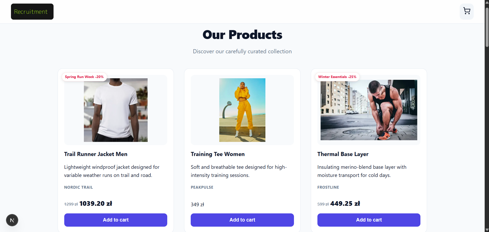

# Product Listing App - Recruitment Task

This is my solution for the recruitment task built with Next.js. The app displays a list of products fetched from an API and allows users to add them to a shopping cart.

[Live Demo](https://shop-app-black-nine.vercel.app)



## Features

- **Data Fetching:** Products are fetched asynchronously from an external API endpoint.
- **Responsive Layout:** I used Flexbox, Grid and Media Queries to make sure the site looks good on both desktop and mobile.
- **Shopping Cart Logic:** Users can add items to a cart. I've also added a "toast" notification to give immediate feedback after clicking.
- **Modern Styling:** I used SCSS Modules for styling to keep everything scoped and clean.
- **User Experience:** Included hover effects, disabled states for buttons, and a sticky header for better navigation.

## Tech Stack

- **Framework:** Next.js
- **Language:** TypeScript
- **Styles:** SCSS Modules
- **Notifications:** React Hot Toast
- **Icons:** Lucide React

## Installation & Setup

```bash
git clone https://github.com/angelika-musial/shop-app.git
cd shop-app
npm install
npm run dev
```
